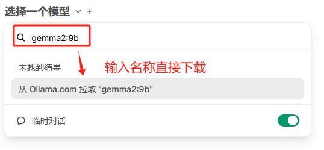

# Win11 本地部署 Open WebUI

Open WebUI 是一个可扩展、功能丰富且用户友好的自托管 Web 用户界面（WebUI），它被设计用于完全离线操作。该项目最初被称为 Ollama WebUI，后来更名为 Open WebUI。Open WebUI 的主要目的是为本地的大语言模型（LLMs）提供一个图形化的交互界面，使得用户能够更加方便地调试和调用本地模型，它不仅支持本地模型，还兼容 Ollama 和 OpenAI 的 API，同时也支持远程服务器上的模型

## win11 本地源码安装

```sh
git clone https://github.com/open-webui/open-webui.git
cd open-webui

copy .env.example .env

# 编译前端
npm install
npm run build

# 进入服务端文件夹
cd .\backend

# 可选: 通过 Conda 虚拟环境安装
conda create --name open-webui-env
conda activate open-webui-env

pip install -r requirements.txt -U

# 执行启动脚本 cd .\backend
start_windows.bat
```

修改运行参数(.env)：

```ini
OLLAMA_BASE_URL='http://localhost:11434'
OPENAI_API_BASE_URL='https://domain.com/v1' # 可从接口查询可用模型
OPENAI_API_KEY='sk-0lkurGuwZAg4T61oB00cD944Ec'
```

## 支持的大模型

<https://ollama.com/library>

## 通过 WebUI 下载模型

直接搜索并下载



或打开管理员面板搜索安装：


## 通过 ollama 下载模型

1. 下载安装 Ollama：win11 安装包下载地址：<https://ollama.com/download>
2. 运行大模型

```sh
ollama run llama3.1：8b
```


3. 刷新 webui 页面可以在列表中找到该模型


## 集成 SD 图像生成

> 需已安装 `stable-diffusion-webui`


```sh
# 设置 sd 以 api 服务方式运行
set COMMANDLINE_ARGS=--xformers --enable-insecure-extension-access --nowebui --api --api-auth admin:1212 --listen --port 7860
```

1. 首先，编写图像生成提示词，让文本生成模型原样回复
2. 完成后，您可以单击回复下方的图标来生成图像
3. 在图像完成生成后，可在聊天中查看


### 推荐 sd 插件

```sh
git clone https://github.com/AlUlkesh/stable-diffusion-webui-images-browser extensions/stable-diffusion-webui-images-browser
git clone https://github.com/butaixianran/Stable-Diffusion-Webui-Civitai-Helper extensions/Stable-Diffusion-Webui-Civitai-Helper
```

<https://github.com/Mikubill/sd-webui-controlnet>

## ComfyUI 安装

1. 下载源码安装依赖

```sh
git clone https://github.com/comfyanonymous/ComfyUI.git
cd ComfyUI.git
/path-to-python10 -m venv venv
pip install torch torchvision torchaudio --extra-index-url https://download.pytorch.org/whl/cu121
pip install -r requirements.txt
```

2. 修改运行参数参数，设置复用 stable-diffusion-webui 目录中的模型：

```sh
# 在 ComfyUI 根目录中
copy extra_model_paths.yaml.example extra_model_paths.yaml
指定 sd 文件夹路径：
base_path: path/to/stable-diffusion-webui/ 
```

3. 安装 ComfyUI-Manager

```sh
cd custom_nodes
git clone --depth=1 https://github.com/ltdrdata/ComfyUI-Manager.git 
```

4. 启动：

```sh
python ./main.py
```

问题：NumPy 2 报错，版本降级：

```sh
pip uninstall numpy
pip install numpy<2
```


## 参考

<https://github.com/open-webui/open-webui>
