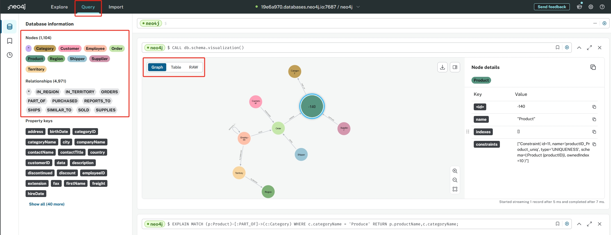
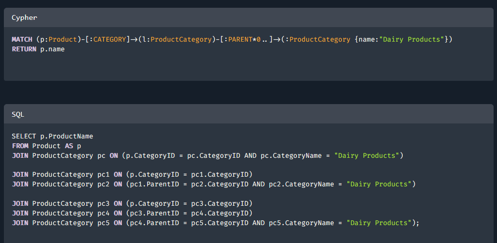
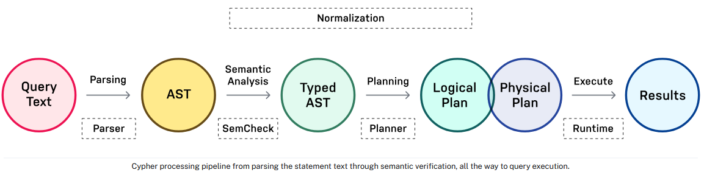

# 图数据库查询语言 Cypher 基础

Cypher 是 Neo4j 的声明式查询语言，为属性图提供了富有表现力和高效的查询，是一种成熟和直观的图数据库查询语言。在图上执行任何类型的创建、读取、更新或删除(CRUD)，Cypher 是 Neo4j 的主要接口。

本文介绍了 Cypher 基础知识，以及如何使用 Neo4j 的查询 UI。



## 一、对比 SQL: 没有更复杂的 Join

Cypher是一种专门为查询图而优化设计的查询语言，可以理解并利用数据连接。它沿着连接-在任何方向-揭示未知的关系和集群。Cypher 查询比大规模 SQL 连接更容易编写。Cypher 查询与 SQL 中的等价查询的比较:



与SQL一样，Cypher的重要概念包括子句、关键字、表达式、操作符和函数。与处理关系数据库的SQL不同，Cypher以表达图形模式为中心。图模式匹配是 Cypher 中的核心技术，通过应用声明性模式，可以从图中创建、导航、描述和提取数据。

## 二、底层: Processing pipeline

Cypher是一种具有高级图形模式和集合支持的表达语言。在底层，处理管道首先解析查询，然后进行语义验证并重写 AST，然后使用可用的`Planner`为所有操作找到最优的执行计划(逻辑和物理)，一直到查询执行。

Cypher 查询根据特定的执行计划执行。执行计划由操作符的二叉树组成，其中包含有关查询逐步执行的信息，并且根据查询使用的运行时可能有所不同。如果希望查看执行计划，但不实际运行查询，请在 Cypher 语句前加上`EXPLAIN`。该语句将始终返回空结果，并且不对数据库进行任何更改。



## 三、语法：直观易学的图查询语言

> 注意：Cypher 关键字不区分大小写，Cypher 对变量区分大小写。

Cypher 的独特之处在于它提供了一种匹配模式和关系的可视化方式。Cypher 的灵感来自于一种字符画艺术 (ASCII-Art) 的语法, `(nodes)-[:ARE_CONNECTED_TO]->(otherNodes)` 使用圆括号表示节点(nodes)， -[:ARROWS]-> 表示关系。在编写查询时，相当于是绘制数据的图形模式。

- 节点标签：使用圆括号表示节点，通过节点标签将相似的节点分类在一起，类似数据库中的一个表， `(:Product)` 中 Product 是节点的一个标签。
- 节点变量: 如果我们以后想要引用节点，我们可以声明一个变量，比如 `(p:Product)`, 后面可以用变量 p 引用节点。
- 关系与方向：两个破折号表示关系，箭头表示方向，创建时必须指定方方向，查询时可不指定方向。 `MATCH (n:Label)-->(m:Label)`
- 关系类型：使用方括号中添加关系类型，关系类型对关系进行分类并添加意义，也可使用变量引用。`-[l:LIKES]->` 中 LIKES 是关系的类型
- 属性：可以在节点或关系的括号内使用花括号来表示属性（键值对），节点属性 `(p:Person {name: 'Sally'})` ，关系属性 `-[rel:IS_FRIENDS_WITH {since: 2018}]->`

节点表示示例：

```cypher
()
(matrix)
(:Movie)
(matrix:Movie)
(matrix:Movie {title: 'The Matrix'})
(matrix:Movie {title: 'The Matrix', released: 1997})
```

关系表示示例：

```cypher
-->
-[role]->
-[:ACTED_IN]->
-[role:ACTED_IN]->
-[role:ACTED_IN {roles: ['Neo']}]->
```

### 模式：结合节点和关系的语法表达模式

节点和关系构成了图形模式的构建块。这些构建块可以组合在一起用来表达复杂的模式。在 Cypher 中，它们可以写成连续的路径，也可以分成更小的模式，并用逗号连接在一起。 `(p:Person {name: "Sally"})-[rel:LIKES]->(g:Technology {type: "Graphs"})`

具体来说，模式用于匹配所需的图结构。一旦找到或创建了匹配的结构，Neo4j 就可以使用它进行进一步的处理。

模式示例：

```cypher
// 节点可以有多个标签
(keanu:Person:Actor {name: 'Keanu Reeves'})-[role:ACTED_IN {roles: ['Neo']}]->(matrix:Movie {title: 'The Matrix'})
// 模式变量，有许多函数可以访问路径的详细信息 nodes(path), relationships(path), and length(path)
path = (:Person)-[:ACTED_IN]->(:Movie)
```

### 子句：表达丰富指令

Cypher语句通常有多个子句，每个子句执行一个特定的任务，例如:

- 在图中创建和匹配模式
- 筛选、规划、排序或分页结果
- 组合语句

通过组合Cypher子句，您可以编写复杂的语句来表达您想要知道或创建的内容。

```cypher
CREATE (a:Person {name: 'Tom Hanks', born: 1956})-[r:ACTED_IN {roles: ['Forrest']}]->(m:Movie {title: 'Forrest Gump', released: 1994})
CREATE (d:Person {name: 'Robert Zemeckis', born: 1951})-[:DIRECTED]->(m)
RETURN a, d, r, m
```

## 四、示例

基于 Northwind 数据集进行演示，Northwind 是一个广泛用于教学和软件开发示例中的示例数据库，这个数据库包含了多个表，用于存储客户、供应商、产品、订单等信息。

1. 可视化查看当前图数据库数据模式，了解数据整体结构：

```cypher
CALL db.schema.visualization()
```

2. 简单的查询语句

```cypher
// 添加行注释
MATCH (p:Product) RETURN p; // 相当于 SELECT p.* FROM products as p;
// 如果不确定方向时尽量使用无箭头查询
MATCH (p:Person)-[:LIKES]-(t:Technology)
```

3. 看哪个供应商提供哪些类别的产品：

```cypher
MATCH (s:Supplier)-->(:Product)-->(c:Category)
RETURN s.companyName as company, collect(distinct c.categoryName) as categories
```

4. 查看指定类别的供应商

```cypher
MATCH (s:Supplier)-->(:Product)-->(c:Category)
WHERE c.categoryName = 'Condiments'
RETURN DISTINCT s.companyName as condimentsSuppliers
```

5. 假设您希望查看哪些产品类别通常与其他产品类别同时下单购买，以及同时下单的频率，帮助你了解哪些产品应该一起推广

```cypher
// which categories are the products of an order in
MATCH (o:Order)-[:ORDERS]->(:Product)-[:PART_OF]->(c:Category)
// retain same ordering of categories
WITH o, c ORDER BY c.categoryName
// aggregate categories by order into a list of names
WITH o, collect(DISTINCT c.categoryName) as categories
// only orders with more than one category
WHERE size(categories) > 1
// count how frequently the pairings occurr
RETURN categories, count(*) as freq
// order by frequency
ORDER BY freq DESC
LIMIT 50
```

6. 查找显示类似购买模式的客户，即哪些客户最常订购类似产品。然后可以用于产品推荐或进行客户群细分。

```cypher
// pattern from customer purchasing products to another customer purchasing the same products
MATCH (c:Customer)-[:PURCHASED]->(:Order)-[:ORDERS]->(p:Product)<-[:ORDERS]-(:Order)<-[:PURCHASED]-(c2:Customer)
// don't want the same customer pair twice
WHERE c < c2
// sort by the top-occuring products
WITH c, c2, p, count(*) as productOccurrence
ORDER BY productOccurrence DESC
// return customer pairs ranked by similarity and the top 5 products
RETURN c.companyName, c2.companyName, sum(productOccurrence) as similarity, collect(distinct p.productName)[0..5] as topProducts
ORDER BY similarity DESC LIMIT 10
```

7. 可以为相似性得分超过50分的所有客户创建关系，已查看它们是如何聚类的。

```cypher
// 新建关系 SIMILAR_TO
MATCH (c:Customer)-[:PURCHASED]->(:Order)-[:ORDERS]->(p:Product)<-[:ORDERS]-(:Order)<-[:PURCHASED]-(c2:Customer)
WHERE c < c2
// find similar customers
WITH c, c2, count(*) as similarity
// with at least 50 shared product purchases
WHERE similarity > 50
// create a relationship between the two without specifying direction
MERGE (c)-[sim:SIMILAR_TO]-(c2)
// set relationship weight from similairity
ON CREATE SET sim.weight = similarity
// 查询
MATCH path=()-[:SIMILAR_TO]->() RETURN path
```

## 更多 <https://neo4j.com/docs/cypher-cheat-sheet>
