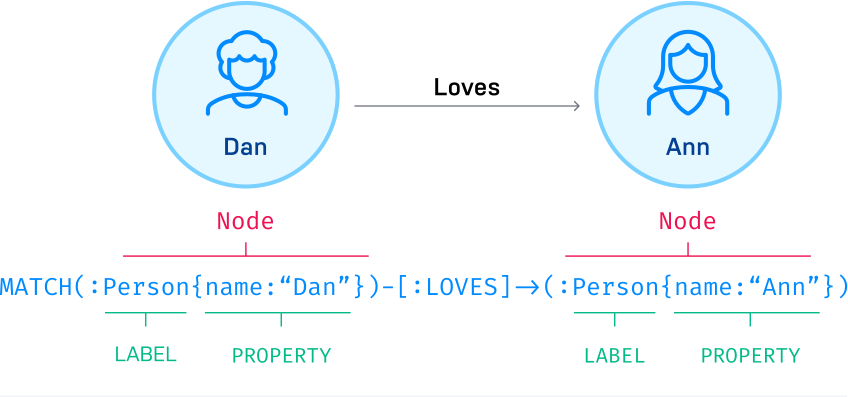
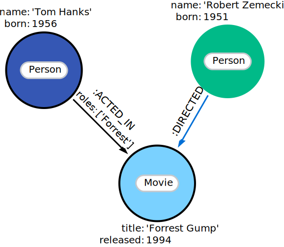
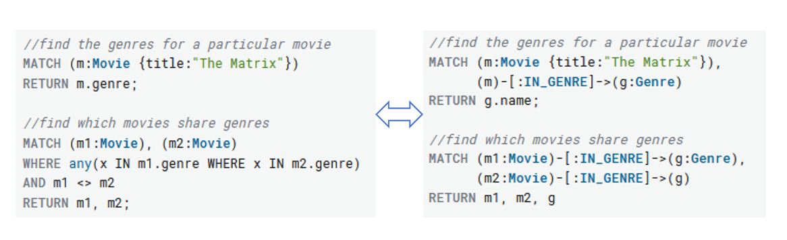
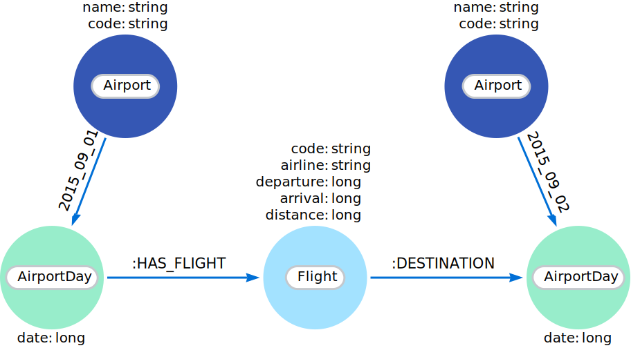
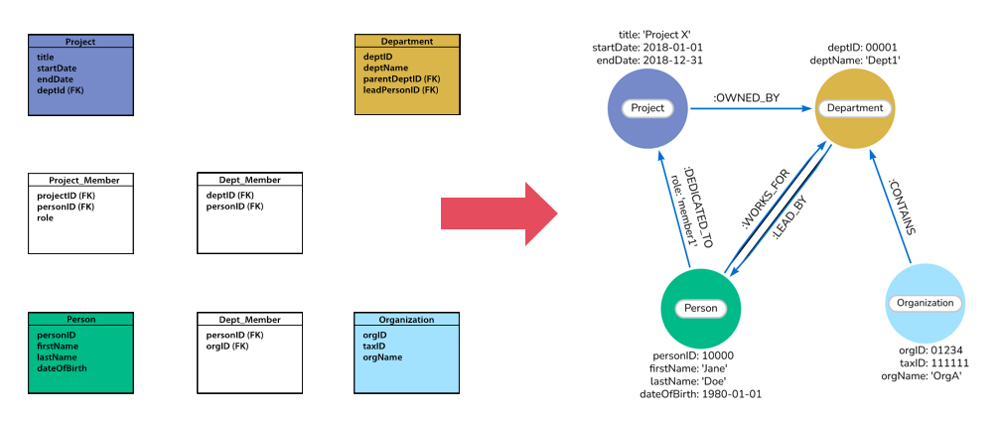
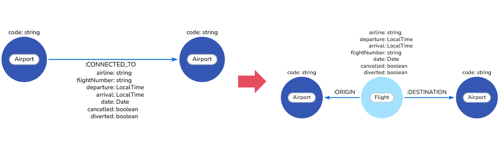
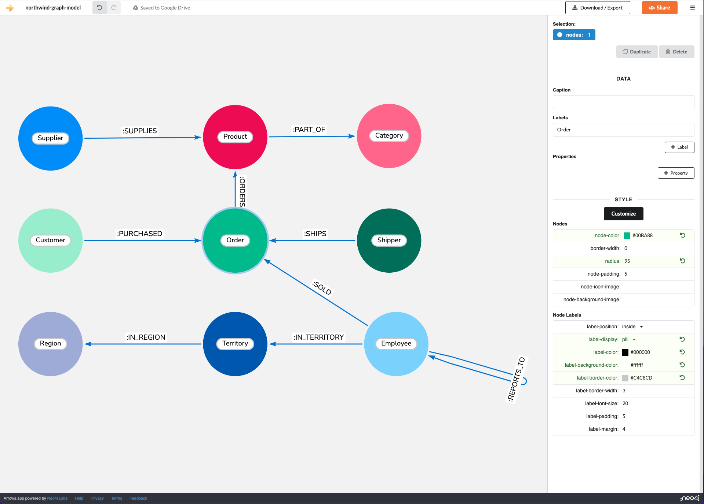

# Neo4j 图数据库入门

图形数据库存储节点和关系，而不是表或文档。数据的存储方式就像你在白板上勾画想法一样。您的数据存储不受预定义模型的限制，允许以非常灵活的方式考虑和使用它。



## 核心概念：属性图形模型

Neo4j使用属性图数据库模型。图数据结构由节点(离散对象)组成，它们可以通过关系连接起来。属性图数据库模型包括:

- 节点(node)：描述领域实体(离散对象)。
- 标签(label)：节点可以有零个或多个标签来定义(分类)它们是什么类型的节点。由于标签可以在运行时添加和删除，因此它们也可以用于标记节点的临时状态。
- 关系(relationship)：描述源节点和目标节点之间的连接关系，也可关联自身。关系将节点组织成结构，允许图类似于列表、树、地图或复合实体——其中任何一种都可以组合成更复杂、更丰富的相互连接的结构。
- 方向(direction)：关系有一个方向。只包含一个节点的路径长度为0。
- 类型(type)：关系必须有一个类型(一种类型)来定义(分类)它们是什么类型的关系。
- 属性(properties)：节点和关系可以具有属性(键值对)，这些属性可以进一步描述它们。


对应:

```cypher
CREATE (:Person:Actor {name: 'Tom Hanks', born: 1956})-[:ACTED_IN {roles: ['Forrest']}]->(:Movie {title: 'Forrest Gump', released: 1994})<-[:DIRECTED]-(:Person {name: 'Robert Zemeckis', born: 1951})
```

## 遍历和路径

遍历是指为了找到问题的答案而查询图表的方式，例如:“我的朋友喜欢什么我还没有的音乐?”或者“如果电源坏了，什么网络服务会受到影响?”
遍历一个图意味着按照一定的规则遵循关系来访问节点。在大多数情况下，只访问图的一个子集。

例如：为了找出汤姆·汉克斯演过哪些电影，遍历将从 `Tom Hanks` 节点开始，遵循连接到该节点的任何 `ACTED_IN` 关系，最终得到 `Movie` 节点《阿甘正传》。



## Schema

Neo4j 中的模式指的是索引和约束。Neo4j 通常被描述为模式可选，这意味着它不需要创建索引和约束。您可以创建数据（节点、关系和属性）而无需预先定义模式。可以在需要时引入索引和约束，以获得性能或建模方面的好处。

## 命名约定

|Graph entity| Recommended style| Example|
|:--:|--|--|
|Node label | Camel case, beginning with an upper-case character| :VehicleOwner rather than :vehicle_owner|
|Relationship type| Upper case, using underscore to separate words |:OWNS_VEHICLE rather than :ownsVehicle|
|Property|Lower camel case, beginning with a lower-case character|firstName rather than first_name|

## 建模

### Property vs relationship

与任何数据库一样，您设计的数据模型对于确定查询的逻辑和存储中的数据结构非常重要。没有最好的数据模型，是否“最佳”取决于您打算对数据运行的查询类型。对数据建模没有正确或错误的方法。有些方法可能更适合您的需求，并且在您优先考虑的方面性能更好。



### Time-bound data and versioning

例如，如果您希望在某人与其当前地址之间创建一个新的有效日期关系，但同时保留过去的地址，则可以使用在关系类型中包含日期的相同原则



有时，您可能会发现一个模型非常适合您需要的某个场景，但另一个模型更适合其他场景。例如，一些模型在写查询方面表现更好，而其他模型在读查询方面表现更好。这两种功能对您的用例都很重要，那么您该怎么做呢?
在这些情况下，您可以结合使用这两种模型，并利用各自的优点。是的，您可以在图中使用多个数据模型!

## 关系型转为图模型

1. 表对应节点标签：关系模型中的每个实体表都成为图模型中节点上的标签。
2. 行对应节点：关系实体表中的每一行都成为图中的一个节点。
3. 列对应节点属性：关系表上的列(字段)成为图中的节点属性。
4. 仅业务主键：删除技术主键，保留业务主键。
5. 添加约束/索引：为业务主键添加唯一约束，为频繁查找属性添加索引。
6. 关系的外键-用关系替换其他表的外键，然后删除它们。
7. 无默认值：删除具有默认值的数据，无需存储这些数据。
8. 清理数据：非规范化表中的重复数据可能必须被拉出到单独的节点中，以获得更干净的模型。
9. 索引列到数组：索引列名(如email1、email2、email3)可能表示数组属性。
10. 将表连接到关系：将连接表转换为关系，这些表上的列成为关系属性



## 图模型建模技巧

要找到适合您需求的最佳数据模型，通常可以使用一些技术并根据分析做出数据模型决策。

### 首先编写查询

了解要对数据提出的问题和查询类型是确定数据模型结构的好方法。如果您知道查询需要返回某个日期范围内的结果，那么您可能应该确保date不是节点上的属性，而是作为单独的节点或关系存储。

### 查询按优先级排序

您应该确定哪种模型最适合您的需求。您可能无法在每个查询上最大化性能，但是您可能能够在使用某些资源、时间和代码的情况下最大限度地利用系统。要做到这一点，您需要决定哪些查询必须绝对具有最大性能，哪些功能对于提供价值至关重要。这可能是一个艰难的决定，但无论您使用的是哪种技术，这些决定都会在某些方面存在。使Neo4j更有价值的是，该模型是灵活的，如果您的优先级随着时间的推移而调整，它可以改变。

### 测试，找到答案的最好方法是用真实数据进行测试

### 重构模型

根据不断变化的需求随时调整您的图模型。

1. 导入 csv 原始航班数据

```cypher
LOAD CSV WITH HEADERS FROM "https://raw.githubusercontent.com/neo4j-contrib/training/master/modeling/data/flights_1k.csv" AS row
MERGE (origin:Airport {code: row.Origin})
MERGE (destination:Airport {code: row.Dest})
MERGE (origin)-[connection:CONNECTED_TO {
  airline: row.UniqueCarrier,
  flightNumber: row.FlightNum,
  date: date({year: toInteger(row.Year), month: toInteger(row.Month), day: toInteger(row.DayofMonth)}),
  cancelled: row.Cancelled,
  diverted: row.Diverted}]->(destination)
ON CREATE SET connection.departure = localtime(apoc.text.lpad(row.CRSDepTime, 4, "0")),
              connection.arrival = localtime(apoc.text.lpad(row.CRSArrTime, 4, "0"))
```

2. 修改属性类型

```cypher
MATCH (:Airport)-[connectedTo:CONNECTED_TO]->(:Airport)
CALL apoc.refactor.normalizeAsBoolean(connectedTo, "diverted", ["1"], ["0"])
RETURN count(*)
```

3. 从关系改为节点



该查询使用了`apoc.periodic.iterate`，这样您就可以分批地进行重构，而不是在单个事务中进行重构，防止数据量过大时内存溢出。

```cypher
CALL apoc.periodic.iterate(
  "MATCH (origin:Airport)-[connected:CONNECTED_TO]->(destination:Airport) RETURN origin, connected, destination",
  "CREATE (flight:Flight {
     date: connected.date,
     airline: connected.airline,
     number: connected.flightNumber,
     departure: connected.departure,
     arrival: connected.arrival,
     cancelled: connected.cancelled,
     diverted: connected.diverted
   })
   MERGE (origin)<-[:ORIGIN]-(flight)
   MERGE (flight)-[:DESTINATION]->(destination)
   DELETE connected",
  {batchSize: 100})
```

4. 从属性创建节点

目前，航空公司名称存储在 Flight 节点的 airline 属性中。这意味着，如果您想返回所有航空公司的流，则必须扫描每个航班并检查每个航班的航空公司属性。

```cypher
CALL apoc.periodic.iterate(
   'MATCH (flight:Flight) RETURN flight',
   'MERGE (airline:Airline {name:flight.airline})
    MERGE (flight)-[:AIRLINE]->(airline)
    REMOVE flight.airline',
   {batchSize:10000, iterateList:true, parallel:false}
)
```

## 工具

### Arrows.app

一个基于 web 的可视化建模工具。<https://neo4j.com/labs/arrows/>



### Neo4j Data Importer

允许您从 `.csv` 文件导入数据，而无需使用任何代码。这意味着您可以从任何可以导出到 `.csv` 文件的数据源导入数据。

<https://neo4j.com/docs/data-importer/current/>
