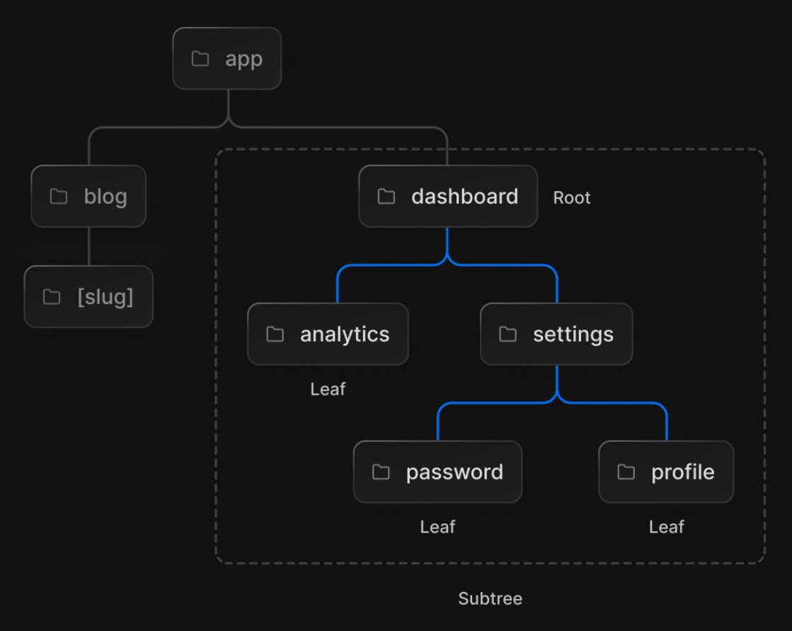
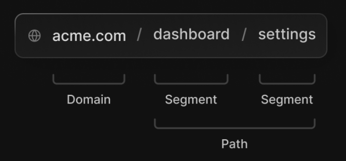
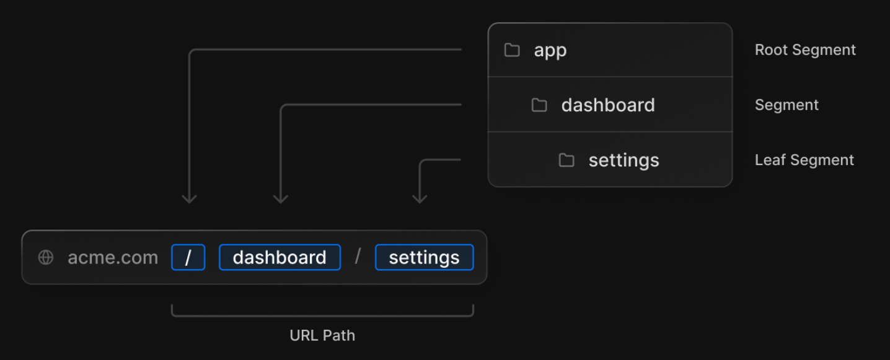
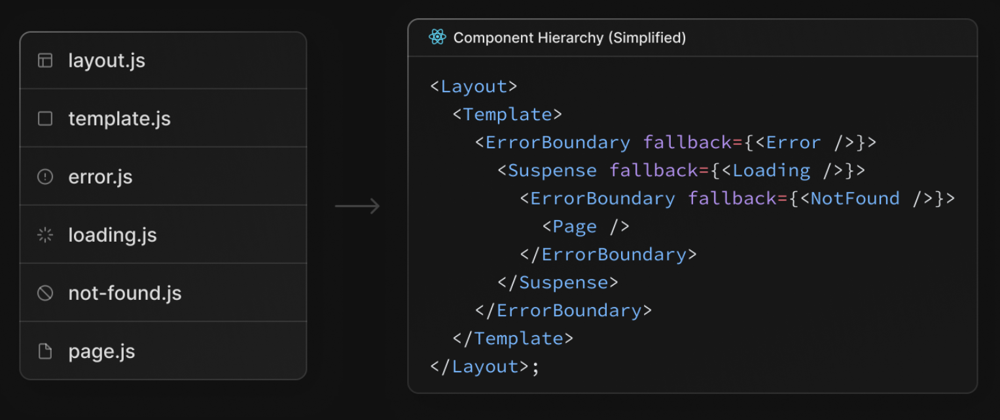
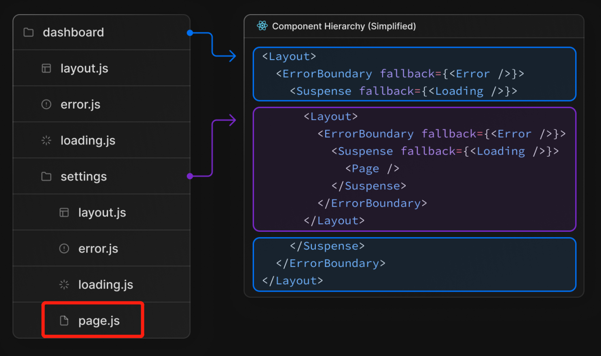
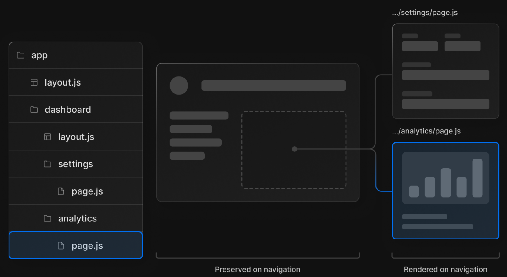

# App Router 简介

Next.js 13 引入了新的应用路由器，它建立在服务端组件之上，支持布局、嵌套路由、加载状态、错误处理等等。本文将介绍新路由模型的基本概念

## 术语

- 树(Tree): 一种用于可视化的层次结构。例如，包含父组件和子组件的组件树，文件夹结构等。
- 子树(Subtree): 树的一部分，从新的根节点（第一个）开始，到叶子节点（最后一个）结束。
- 根节点(Root): 树或子树中的第一个节点
- 叶子节点(Leaf): 子树中没有子节点的节点，例如 URL 路径的最后一段。

- URL 段(URL Segment): 用斜杠分隔的 URL 路径的一部分
- URL 路径(URL Path): 域名之后的URL的一部分(由段组成)。

## app 目录说明

新的 App Router 路由模式工作在一个名为 app 的新目录中。与原 pages 目录一起工作，以允许增量使用。注意跨目录的路由不应该解析为相同的URL路径，会导致构建时错误以防止冲突。app 目录中的组件默认是服务端组件（[React Server Components](https://beta.nextjs.org/docs/rendering/server-and-client-components)）。

- app 目录下的文件夹用于定义路由。路由是嵌套的文件夹下的一条路径：从根文件夹到包含 page.js 文件的叶子节点文件夹的一条路径。
- app 目录下的文件用于创建路由段显示的 UI 界面，参见下文[文件约定](#文件约定-file-conventions)。

## 路由段 Route Segments

路由中的每个文件夹代表一个路由段（route segment）。每个路由段都映射到 URL 路径中的对应段。

- **嵌套路由** (Nested Routes), 如 `/dashboard/settings` 路由可以通过在 `app` 目录下添加两级目录实现

## 文件约定 File Conventions

next.js 提供了一组文件，用于在嵌套路由中创建具有特定行为的 UI:

- page.js: 为路由创建独特的 UI 界面，并使该路径可公开访问
- route.js: 为路由创建服务器端 API 端点，不能与 page.js 在同一路径下
- layout.js: 为路由段及其子段创建共享UI，以包装页面或子段
- template.js: 类似 layout.js，当需要创建一个新的组件实例时使用
- loading.js: 为路由段及其子段创建加载界面
- error.js: 为路由段和它的子段创建错误UI。如果捕获到错误，则显示错误UI
- global-error.js: 类似于 error.js，专用于捕获根布局中的错误
- not-found.js: 用于创建 `notFound` 函数调用或者当 URL 没有被任何路由匹配时显示的界面

## 组件层次 Component Hierarchy

1. 在同一路由段的文件中定义的组件会在特定的层次结构中呈现

1. 在一个嵌套路由中，一个段的组件将被嵌套在它的父段的组件中

1. 除了特殊文件之外，您还可以选择将自己的文件放在文件夹中。例如，样式、测试、组件等等。

## 以服务器路由为中心的客户端导航

与使用客户端路由的 pages 目录不同，app 目录中的新路由器使用以服务器为中心的路由，以便与服务器上的服务端组件和数据获取保持一致。客户端不必下载路由图，并且可以使用对服务端组件的相同请求来查找路由。这种优化对所有应用都有用，对路由多的应用影响更大。

虽然路由是以服务器为中心的，但使用 Link 组件的客户端导航具有类似于单页应用程序的行为。这意味着当用户导航到新路由时，浏览器不会重新加载页面。但 URL 将被更新，Next.js 将只呈现更改的部分。

此外，当用户浏览应用程序时，路由器会将服务端组件数据存储在客户端缓存(内存)中。缓存按路由段分割，允许在任何级别失效，并确保并发渲染的一致性。这意味着在某些情况下，可以重用先前获取的段的缓存，从而进一步提高性能。

## 局部渲染 Partial Rendering

当在同级路由之间导航时(例如 `/dashboard/` 下的 `/dashboard/settings` 和 `/dashboard/analytics`)， Next.js 只会获取和渲染路由中发生变化的布局和页面。它不会重新获取或重新渲染子树中段以上的任何内容。这意味着在共享布局的路由中，当用户在兄弟页面之间导航时，该布局将被复用。如果没有局部渲染，每个导航都会导致整个页面在服务器上重新渲染。只渲染需要更新的段可以减少传输的数据量和执行时间，从而提高性能。

- 高级路由模式

将来，Next.js 路由器将提供一组约定来帮助你实现更高级的路由模式。这些包括:

1. 并行路径: 允许您在同一视图中同时显示两个或多个可以独立导航的页面。用于具有自己的子导航的分屏视图，例如仪表板。
2. 拦截路由: 允许你拦截一条路由，并在另一条路由的上下文中显示它。在保持当前页面的上下文很重要时使用。例如，在编辑一个任务时查看所有任务，或在 Feed 中查看图片。
3. 条件路由: 允许您根据条件有条件地呈现路由。例如:只在用户登录后才显示。
